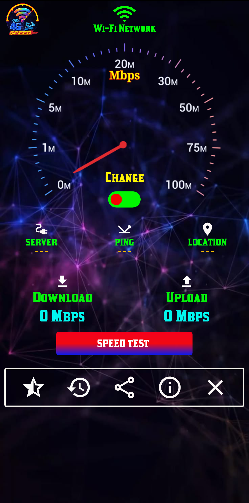
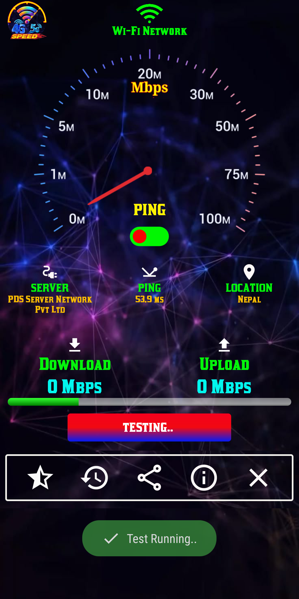
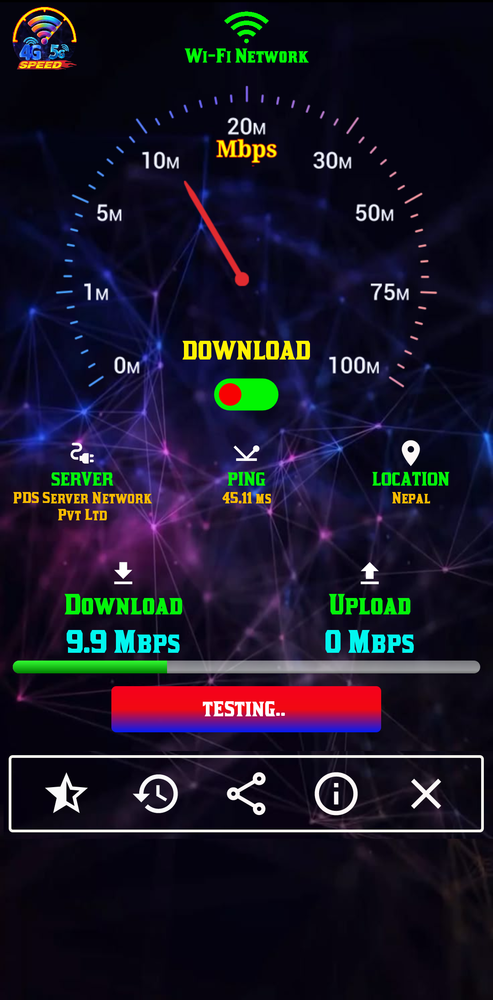
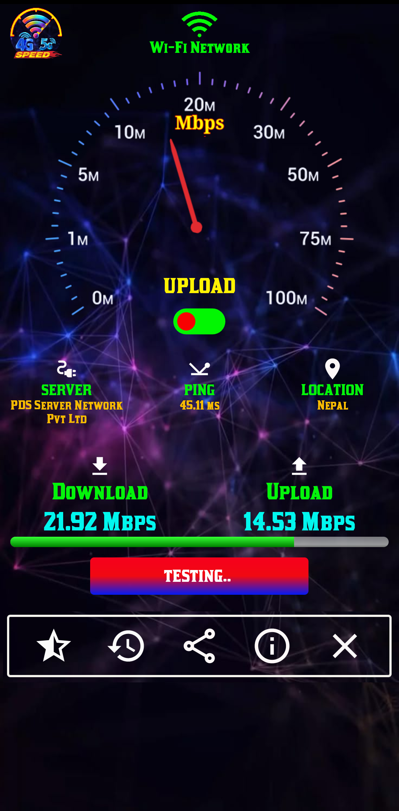
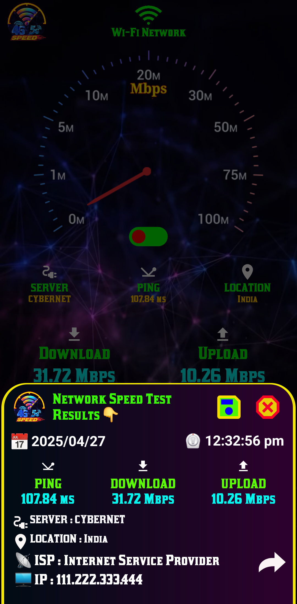
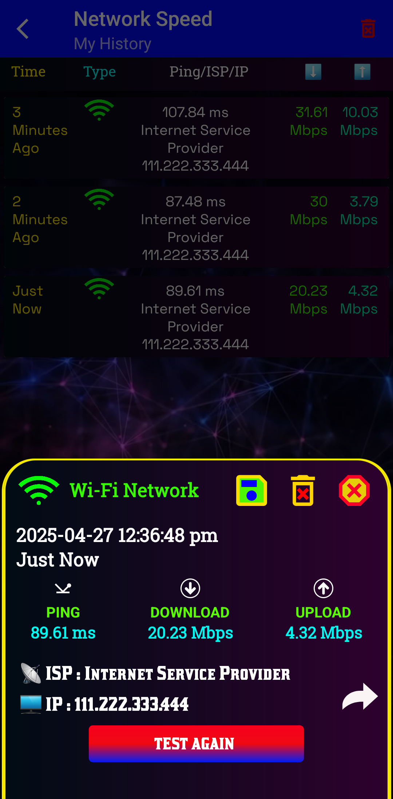

  

# 🚀 Internet Speed Test

Test your internet speed with accurate download, upload, and ping measurements.

Internet Speed Test is a fast, lightweight Android application that measures your internet connection performance with real-time results. Monitor download speed, upload speed, ping, and network information anytime, anywhere.

---

## 📱 Features

* 🚀 Fast and accurate speed testing
* 📥 Measure download speed
* 📤 Measure upload speed
* 📶 Check ping (latency)
* 📡 View network information (Wi-Fi & Mobile Data)
* 📊 Real-time speed graphs
* 📈 Save and view speed test history
* 🌍 Automatic server selection
* 🔄 One-tap speed test
* 📱 Clean and modern user interface
* ⚡ Lightweight and optimized
* 🔒 Secure and privacy-friendly

---

## 📥 Download on Google Play

---

## 📸 Screenshots

<table>
  <tr>
    <td></td>
    <td></td>
    <td></td>
    <td></td>
  </tr>
  <tr>
    <td></td>
    <td></td>
    <td></td>
    <td></td>
  </tr>
</table>

---

## 📧 Contact

**Developer:** NK Tech (NP)

📧 Email: [ournktech@gmail.com](mailto:ournktech@gmail.com)

🌐 Website: https://ournktech.com/

---

## ⭐ Support

If you enjoy **Internet Speed Test**, please give this repository a ⭐ on GitHub!

---

## 📄 License

This project is licensed under the MIT License.
